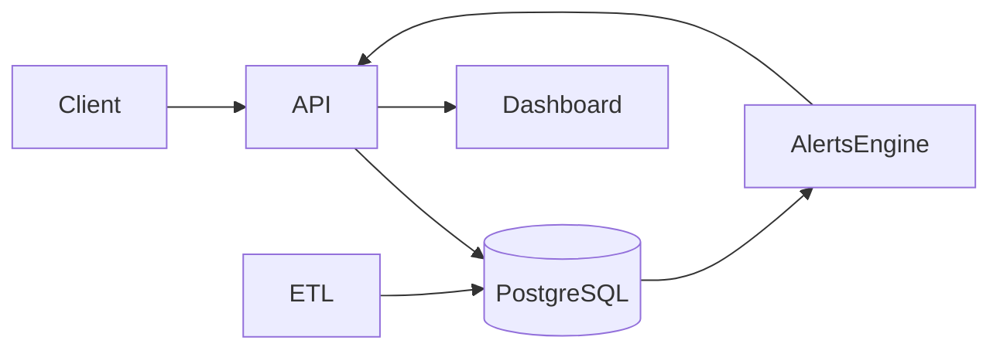

# Arquitetura Missão 2

## Diagrama

```mermaid
flowchart LR
    Client --> API
    API --> DB[(PostgreSQL)]
    ETL --> DB
    DB --> AlertsEngine
    AlertsEngine --> API
    API --> Dashboard
```

### Endpoints
- POST /upload
- GET /metrics?age&region
- GET /alerts
